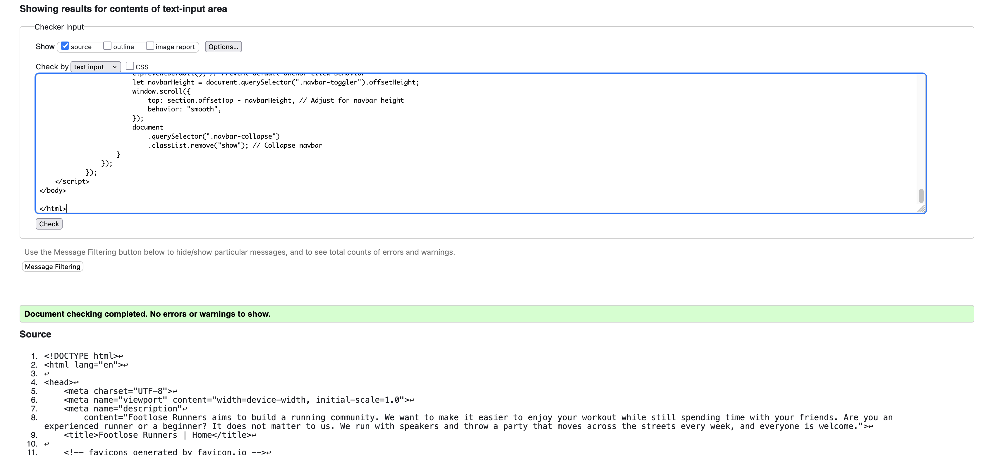
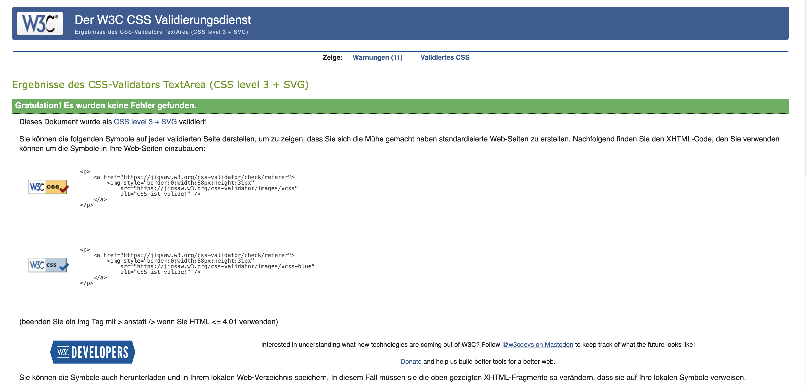
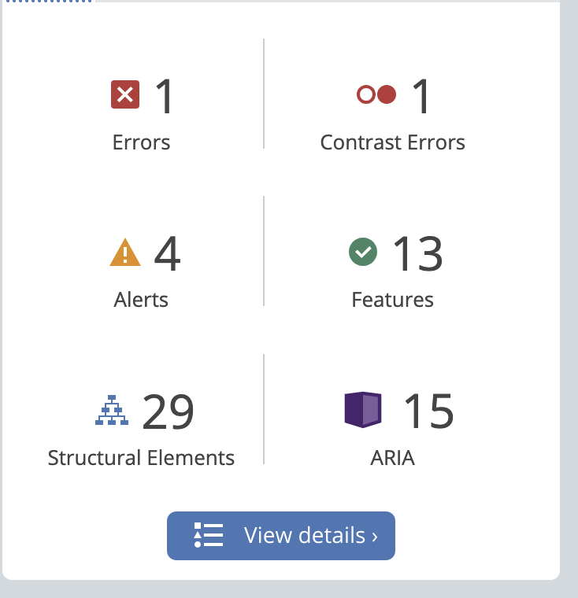
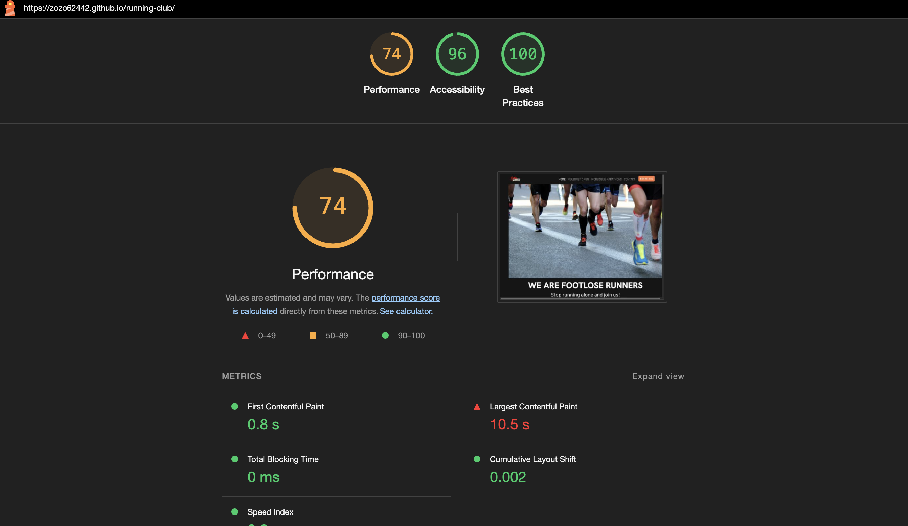
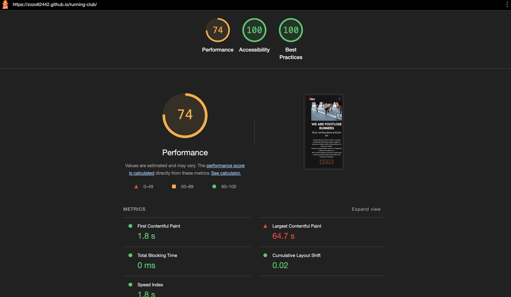

# Footlose Runners
Run Club Global is your gateway to an active, like-minded community of runners—whether you’re training for your first 5K or dreaming of a world-tour marathon. With a bold, full-screen hero image and three compelling reasons to lace up, our site immediately shows you why running with us matters. Explore five of the most iconic marathons around the globe through richly illustrated feature cards, then get in touch via our embedded map and contact details or join directly with a simple, validated sign-up form. Finally, soak up the club spirit in our photo gallery of past events. Built with Bootstrap and flexbox for seamless responsiveness, clear navigation, and accessible design, Run Club Global makes it effortless to find inspiration, connect with fellow runners, and take your next stride.

[Contents](#contents)
  * [User Goals](#user-goals)
  * [User Stories](#user-stories)
  * [Website Goals and Objectives](#website-goals-and-objectives)
  * [Wireframes](#wireframes)
  * [Design Choices](#design-choices)
    + [Typography](#typography)
    + [Colour Scheme](#colour-scheme)
    + [Images](#images)
- [Features](#features)
  * [Existing Features](#existing-features)
    + [Header](#header)
    + [Home (Landing) View](#landing-view)
    + [Marathons View](#marathon-view)
    + [Sign-Up View](#sign-up-view)
    + [Footer / Contact](#footer/contact)
  * [Future Enhancements](#future-enhancements)
- [Technologies Used](#technologies-used)
  * [Languages](#languages)
  * [Libraries & Framework](#libraries---framework)
  * [Tools](#tools)
- [Testing](#testing)
  * [Bugs Fixed](#bugs-fixed)
  * [Responsiveness Tests](#responsiveness-tests)
  * [Code Validation](#code-validation)
    + [HTML](#html)
    + [CSS](#css)
  * [Feature Testing](#feature-testing)
  * [Accessibility Testing](#accessibility-testing)
  * [Lighthouse Testing](#lighthouse-testing)
  * [Browser Testing](#browser-testing)
- [Deployment](#deployment)
  * [To deploy the project](#to-deploy-the-project)
- [Credits](#credits)

## User Goals

* Find club info quickly: Clear, intuitive navigation to Home, Marathons, Contact, Sign-Up, Gallery.
* Understand club benefits: Three compelling reasons to run with us showcased up front.
* Browse inspiring races: Glimpse five top global marathons with imagery and key facts.
* Get in touch easily: Club email, phone, meetup address & map embedded.
* Join the club: Simple, validated sign-up form collecting name, email, preferred training time.
* See club spirit: Photo gallery of past runs conveys community vibe.
* Use on any device: Fully responsive from mobile through desktop.

## User Stories 

* As a first-time visitor, I want intuitive navigation and a responsive layout, so I can explore the running club site on any device.
* As a prospective member, I want to read three clear reasons to join, so I understand the club’s value.
* As a runner, I want a showcase of five remarkable global marathons, so I can dream about my next race.
* As an interested runner, I want to see contact details and an embedded map, so I can plan a visit.
* As a new member, I want a quick sign-up form with validation, so I can join the club without confusion.
* As a curious visitor, I want a gallery of past events, so I feel the community energy.
* As a social runner, I want social-media links and share buttons, so I can follow and spread the word.
* As a returning fan, I want to subscribe to a “Club Roundup” newsletter, so I never miss news.
* As a frequent visitor, I want the site to load fast and stay legible, so I have a smooth experience.
* As an accessibility-minded user, I want good contrast and alt text on images, so the site is inclusive.

## Website Goals and Objectives

* Inform & inspire by present club benefits and global marathons in a concise, visually engaging way.
* Convert Visitors to Members by guiding readers through reasons → contact → sign-up flow.
* Showcase the community using a gallery of real runners emphasizes club spirit.
* Maintainability & Performance using clean, semantic HTML & CSS; optimized assets; mobile-first responsiveness.
* Make it accessible & SEO conform by using proper headings, alt text, ARIA where needed; meta tags for discoverability.

## Target Audience

* Local and visiting runners (all levels)
* Marathon dreamers looking for inspiration
* Community-oriented athletes seeking group training
* Casual site visitors curious about global races

[Back to top](#contents)

## Wireframes
### Mobile-first sketches created in Balsamiq:
* Hero + reasons stacked
* Marathon cards in single column
* Contact info

### Tablet & Desktop:
* Hero full-width carousel
* Reasons as three-column grid
* Marathon cards in two- or three-column grid
* Contact bottom
* Success page address and map side-by-side

[Mobile Wireframes](/docs/wireframe-mobile.png "Mobile Wireframes")

[Desktop Wireframes](/docs/wireframe-desktop.png "Mobile Wireframes")

## Design Choices

### Typography
* Headings: Montserrat, sans-serif — bold, modern, energetic
* Body: Open Sans, sans-serif — highly legible for paragraphs and lists

### Colour Scheme 
Colour scheme was chosen based on the palette of energetic “sunrise” and “track” hues to evoke motion and community fitting running:

[Contrast Grid](/docs/colours-runners-club.png)
| CSS Name                 | HEX       | Comment                       |
| ------------------------ | --------- | ----------------------------- |
|     --primary-colour     | #F9F9F9 | Body text                     |
|     --secondary-colour   | #ff7b3f | Buttons, links, highlights    |
|     --bg-dark            | #151515 | Page background               |
|     --accent-color       | #ff4828 | Hover states                  |
|     --muted-gray         | #8F908E | Secondary text                |

## Images
Images and background images were sourced from getty images and from Unsplash. For background images I used an overlay to highlight the text in front of it. 

## Features

### Existing Features

#### Header & Navigation
* Sticky Bootstrap navbar with anchor links to each major section.
* Collapsible mobile menu with clear “hamburger” icon.

#### Home (Landing) View
* Hero: Full-width carousel of images.
* 3 Reasons: Bootstrap cards/flex items, titles, 1–2-line blurbs.
* Quick information on running schedule and join button.

#### Marathons View
* Section title “Incredible Global Marathons.”
* Five Bootstrap cards laid out responsively, each with:
   * Race image (alt text)
   * Name, location
   * Short blurb below (e.g., “Run under the Brandenburger Tor!”)

#### Sign-Up View
* Form collecting: Name, Email, Preferred Training Day selector.
* HTML5 validation (required, type="email").
* Submits to success.html.

#### Footer / Contact 
* Club email, phone and address.
* Social icons (Facebook, Instagram, Strava) linking to club profiles.

#### Future Enhancements
* Events Calendar: visual calendar of upcoming runs.
* Testimonials Slider: rotating quotes from members.
* Dynamic Map: filterable map of training routes.
* Multi-language Support: English + local language toggles.
* Blog Section: articles on training tips & race recaps.
* Social Sharing: “Share this Marathon” buttons via Twitter/FB intents.

# Technologies Used

## Languages

- [HTML](https://developer.mozilla.org/en-US/docs/Glossary/HTML5 "HTML")
- [CSS](https://developer.mozilla.org/en-US/docs/Web/CSS "CSS")

## Libraries & Framework

- [Google Fonts](https://fonts.google.com/ "Google Fonts")
- [Favicon](https://favicon.io/ "Favicon")

## Tools

* [GitHub](https://github.com/ "GitHub")
* [Balsamiq](https://balsamiq.com/wireframes/ "Balsamiq")
* [W3C HTML Validation Service](https://validator.w3.org/ "W3C HTML")
* [W3C CSS Validation Service](https://jigsaw.w3.org/css-validator/ "W3C CSS")
* [TOC Generator](https://ecotrust-canada.github.io/markdown-toc/ "TOC Generator")
* [Color Contrast Accessibility Validator](https://color.a11y.com/ "Color Contrast Accessibility Validator")

[Back to top](#contents)

# Testing

## Bugs 

The webpage was thoroughly tested. 4 bugs are still unresolved and require further investigation: 

| Bug                              | Status     | Description                                                                                                                                                                                                                                                                                                                         | Steps To Resolve                                                                                                                                                                                                                             |
| -------------------------------- | ---------- | ----------------------------------------------------------------------------------------------------------------------------------------------------------------------------------------------------------------------------------------------------------------------------------------------------------------------------------- | -------------------------------------------------------------------------------------------------------------------------------------------------------------------------------------------------------------------------------------------- |
| Images and logo not appearing | Fixed  | When opening the deployed page, the images and logo would now show.  | Used wrong linking method. Removed the "../" from the beginning of the path to the assets - image folder.                                                                     |
| Styling of page would not load | Fixed | When opening the deployed page, all the styling was missing and left me with the default settings. | Similar problem as with the images, I had to change the file path link by removing "../" . |
| Navigating to reasons section covers title | Unresolved | When clicking on Reasons button on the navbar, the redirections would cover the title. | This requires further troubleshooting.  |
| Success page background image does not appear | Resolved | The image would not load when reaching the success page. | I set the image to a background image on a different z-axis to have it in the background and added a transparent-blackish overlay to have the text stand out. |
| Location map and address on success page not centerd | Unresolved | When reaching the success page, the location map and address card is not centered. | This requires further troubleshooting. I have tried googling this issue and also trying to have the order: container, row and column, additionaly removing inline styling. Nothing has worked so far.|
| Carousel-hero images are too large on the xl-screens | Unresolved | On the home page, the carousel with the hero images are larger in height, than the xl-screen, going below the viewport. | This requires further troubleshooting.|

[Back to top](#contents)

## Responsiveness Tests

I released the website quite early in order to test its responsiveness. I used the DevTools browsers Google Chrome to confirm all of my changes, according to the mobile-first approach. The external website [Responsive Design Checker](https://responsivedesignchecker.com/ "Responsive Design Checker") was used to test deployed versions. To get a consistent view of various device breakpoints, another external source was the [Am I Responsive](https://ui.dev/amiresponsive "Am I responsive") website.

Final Test Results:

| Size | Device Example     | Navigation | Element Alignments | Content Placement | Functionality | Notes                                             |
| ---- | ------------------ | ---------- | ------------------ | ----------------- | ------------- | ------------------------------------------------- |
| sm   | Samsung Galaxy S20 | Good       | Good               | Good              | Good          | 
| sm   | iPhone 11 PRO      | Good       | Good               | Good              | Good          | Updated font size of the start area
| sm   | iPhone 13 PRO MAX  | Good       | Good               | Good              | Good          | Updated header bottom margin to fit quiz container 
| md   | iPad MINI          | Good       | Good               | Good              | Good          |                                                   |
| md   | Galaxy Tab S7      | Good       | Good               | Good              | Good          |                                                   |
| md   | iPad Air           | Good       | Good               | Good              | Good          |                                                   |
| lg   | iPad Pro           | Good       | Good               | Good              | Good          |                                                   |
| xl   | Mackbook Air       | Good       | Good               | Good              | Good          |                             
| xl   | HP Stream Laptop   | Good       | Good               | Good              | Good          |
| xxl  | Dell Lattitude     | Good       | Good               | Good              | Good          | Updated font weight for support headings                                        |
| xxl  | Desktop            | Good       | Good               | Good              | Good          |                                                   |

[Back to top](#contents)

## Code Validation

### HTML

I have used [W3C HTML Validation Service](https://validator.w3.org/ "W3C HTML"). I have tested 3 html files. They all came back without errors.

* Main Footloose Running Club Page:

* Sign-up Acknowledgement:

[Back to top](#contents)

### CSS

CSS code for the webpage was validated on [W3C CSS Validation Service](https://jigsaw.w3.org/css-validator/ "W3C CSS Validator"). It has returned errors only relating to external cdnjs file which is used for font awesome icons. There were no errors relating CSS code for this website. 

[Back to top](#contents)

## Feature Testing

This website was extensively tested for functionality using Firefox developer tools.

Every feature was manually tested.. 

[Back to top](#contents)

## Accessibility Testing

I have used web accessibility evaluation tool [WAVE Tool](https://wave.webaim.org/) which helps to determine if web content is accessible to individuals with diverse needs. No issues were raised.

In addition to WAVE testing, I have tested my webpage for color contrast accessibility on [Color Contrast Accessibility Validator](https://color.a11y.com/).

[Back to top](#contents)

## Lighthouse Testing

The Ultimate Animation Quiz has been tested in the [Chrome Dev Tools](https://developer.chrome.com/docs/devtools/) and [Microsoft Edge Dev Tools](https://docs.microsoft.com/en-us/microsoft-edge/devtools-guide-chromium/open/?tabs=cmd-Windows) using Lighthouse Testing tool which inspects and scores the website for the following criteria:

* Performance - how quickly a website loads and how quickly users can access it.
* Accessibility - test analyses how well people who use assistive technologies can use your website.
* Best Practices - checks whether the page is built on the modern standards of web development.
* SEO - checks if the website is optimised for search engine result rankings.

Tests for Desktop on Lighthouse Chrome:

Tests for Mobile on Lighthouse Chrome:

Tests for Desktop Lighthouse Edge:

Tests for Mobile on Lighthouse Edge:

[Back to top](#contents)

## Browser Testing

The Footloose Running Club website was examined for bugs and malfunctions using a variety of browsers. Opera, Firefox, Google Chrome, and Microsoft Edge were selected for thorough testing. Additionally, I have registered with [BrowserStack](https://live.browserstack.com/) in order to test my page on both Safari and Internet Explorer. Due to its age, Internet Explorer's initial results were quite subpar. On an iPad and an iPhone, I tested Safari. For the website's final version, no significant problems were discovered on the top 4 browsers. The test findings were verified. 

[Browser Compatibility Manual Test](docs/browser-compatibility-test-results.pdf "Browser Compatibility Manual Test")

[Back to top](#contents)

# Deployment

## To deploy the project

The Running-club Wbsite was deployed on GitHub pages via the following steps:

- Navigate to the repository on GitHub and click on **Settings**.

- In the side navigation and select **Pages**.

- In the **None** dropdown and choose **Main**.

- Click on the **Save** button.

- The website is now live at https://zozo62442.github.io/running-club/.

_Any changes required to the website, they can be made, committed and pushed to GitHub._

[Back to top](#contents)

# Credits

- Feedback, advice and support:

  - [Simen Daehlin](https://github.com/Eventyret "Simen Daehlin")